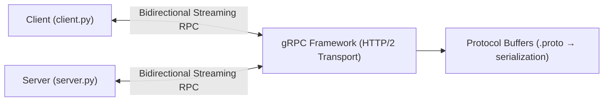

# Лабораторная работа №1  
## Реализация RPC-сервиса с использованием gRPC  
### Вариант 4 — Онлайн-чат (Bidirectional Streaming)

---

# 1. Цель работы

Освоить принципы удаленного вызова процедур (RPC) и их применение в распределённых системах.  
Изучить основы фреймворка gRPC и языка Protocol Buffers.  
Реализовать клиент-серверное приложение на Python с использованием двунаправленного потокового RPC.

---

# 2. Номер и описание варианта

**Вариант 4 — Онлайн-чат**

Сервис `ChatService`  
Метод `SendMessage(stream ChatMessage)`  

Тип RPC: **Bidirectional streaming RPC**

Клиент и сервер могут одновременно отправлять друг другу поток сообщений.

Операционная система: macOS

Язык программирования: Python 3.8+

---

# 3. Архитектура системы




## Компоненты системы

1. **chat.proto**
   - описание структуры данных
   - описание сервиса
   - определение метода

2. **server.py**
   - реализует сервис ChatService
   - принимает поток сообщений
   - отправляет ответы

3. **client.py**
   - создаёт поток сообщений
   - отправляет их серверу
   - получает ответы

---

# 4. Листинг chat.proto

```proto
syntax = "proto3";

// Название пакета
package chat;

// Описание сервиса
service ChatService {
  // Двунаправленный поток сообщений
  rpc SendMessage(stream ChatMessage) returns (stream ChatMessage);
}

// Структура сообщения чата
message ChatMessage {
  string user = 1;        // Имя отправителя
  string message = 2;     // Текст сообщения
  string timestamp = 3;   // Время отправки
}
```
**Пояснение**
- stream перед типом — поток сообщений
- stream после returns — сервер тоже отправляет поток

---

# 5. Листинг server.py


```python
import grpc
from concurrent import futures
import time

import chat_pb2
import chat_pb2_grpc


# Реализация сервиса
class ChatService(chat_pb2_grpc.ChatServiceServicer):

    # Двунаправленный поток сообщений
    def SendMessage(self, request_iterator, context):

        # Обработка входящего потока
        for message in request_iterator:
            print(f"[{message.timestamp}] {message.user}: {message.message}")

            text = message.message.lower()

            # Логика автоответа
            if text == "привет":
                reply = "привет"
            elif text == "как дела":
                reply = "хорошо, а твои как?"
            else:
                reply = f"Сообщение получено: {message.message}"

            # Отправка ответа клиенту
            yield chat_pb2.ChatMessage(
                user="Server",
                message=reply,
                timestamp=str(time.time())
            )


def serve():
    server = grpc.server(futures.ThreadPoolExecutor(max_workers=10))
    chat_pb2_grpc.add_ChatServiceServicer_to_server(ChatService(), server)

    server.add_insecure_port('[::]:50051')
    server.start()

    print("Сервер запущен на порту 50051...")
    server.wait_for_termination()


if __name__ == "__main__":
    serve()
```
---

# 6. Листинг client.py

```python
import grpc
import time
import chat_pb2
import chat_pb2_grpc


# Генератор сообщений
def generate_messages():
    while True:
        text = input()
        yield chat_pb2.ChatMessage(
            user="Client",
            message=text,
            timestamp=str(time.time())
        )


def run():
    # Создание канала
    channel = grpc.insecure_channel('localhost:50051')

    # Создание стаба
    stub = chat_pb2_grpc.ChatServiceStub(channel)

    # Вызов метода сервера
    responses = stub.SendMessage(generate_messages())

    # Получение ответов
    for response in responses:
        print(f"\n{response.user}: {response.message}")


if __name__ == "__main__":
    run()
```
---
# 7. Успешная работа сервера и клинета


# 8. Выводы
В ходе выполнения лабораторной работы я реализовал RPC-сервис с использованием gRPC и Protocol Buffers.
Был разработан .proto файл, сгенерирован Python-код, реализованы серверная и клиентская части.
Особое внимание уделено реализации двунаправленного потокового взаимодействия (Bidirectional Streaming RPC), при котором обе стороны могут одновременно отправлять сообщения.
Получены практические навыки построения распределённых клиент-серверных систем.
