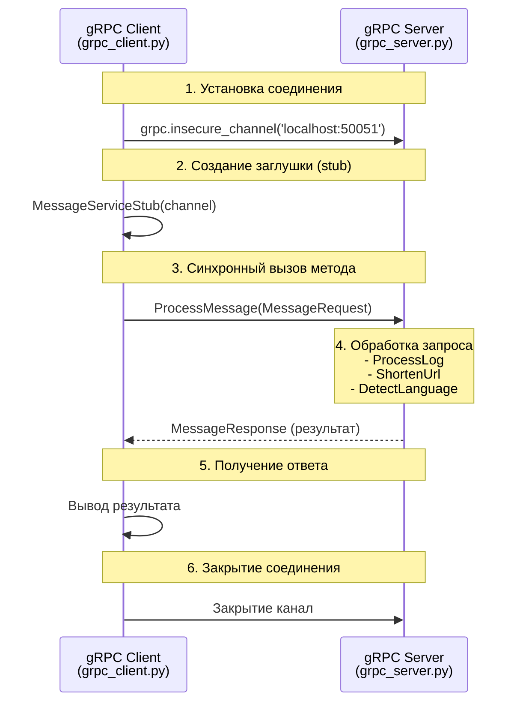
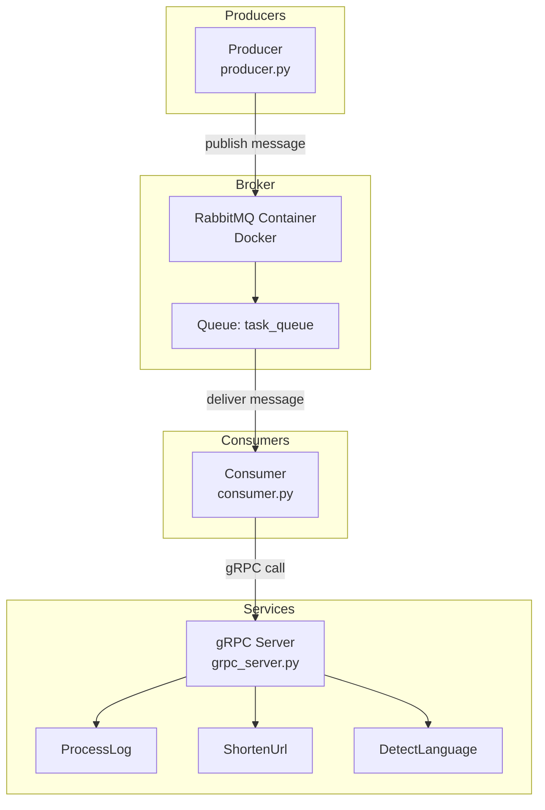

# Лабораторная работа №3.1: Организация асинхронного взаимодействия микросервисов с помощью брокера сообщений

## Цель работы 
Изучить и реализовать два ключевых подхода к
взаимодействию между сервисами: синхронное прямое взаимодействие с
использованием gRPC и асинхронное взаимодействие через брокера сообщений
RabbitMQ. Освоить развертывание инфраструктурных компонентов с помощью
Docker.

## Описание работы

В данной лабораторной работе реализованы два подхода к взаимодействию между сервисами:
1. **Синхронное взаимодействие** с использованием gRPC
2. **Асинхронное взаимодействие** через брокер сообщений RabbitMQ

## Архитектура системы
**Часть 1 (gRPC). Описание синхронного
взаимодействия клиента и сервера.**

**Часть 2 (RabbitMQ). Взаимодействие компонентов (Producer, RabbitMQ, Consumer, gRPC
Server)**

## Технологии

- **Python 3.13** - язык программирования
- **gRPC** - фреймворк для синхронного взаимодействия
- **Protocol Buffers** - язык описания контрактов
- **RabbitMQ** - брокер сообщений
- **Docker** - контейнеризация RabbitMQ
- **Pika** - Python клиент для RabbitMQ

## Основные скрины
**Запущенный gRPC сервер.**

---

**Запущенный Consumer в режиме ожидания.**

---

**Терминал, где Producer отправляет сообщение.**

---

**Терминал Consumer'а с логами получения и обработки сообщения.**

---

### Тест 1
Сервер включен, consumer включен.

- Producer отправил сообщение (Publish)
- RabbitMQ доставил его Consumer (Deliver)
- Consumer обработал и подтвердил (Consumer ack)

### Тест 2
Сервер включен, consumer выключен.

- Producer отправил 4 сообщения в RabbitMQ
- Consumer был выключен → не мог забирать сообщения
- RabbitMQ сохранил все сообщения в очереди (параметр durable=True)
- Результат: 4 сообщения накопились и ждут обработки (Ready = 4)

### Тест 3
Сервер выключен, consumer выключен.

- Producer отправил сообщение в RabbitMQ
- Consumer выключен → не забирает сообщение
- gRPC сервер выключен → даже если бы Consumer работал, не смог бы обработать
- RabbitMQ сохранил сообщение в очереди

---

## Вывод 
В ходе выполнения лабораторной работы я реализовал два подхода к взаимодействию микросервисов: синхронный (gRPC) и асинхронный (RabbitMQ). Сначала я создал контракт в файле message.proto с методами ProcessLog, ShortenUrl и DetectLanguage, сгенерировал Python-код и разработал gRPC-сервер для обработки логов, сокращения ссылок и определения языка текста. Затем развернул RabbitMQ в Docker-контейнере с помощью docker-compose.yml, создал Producer для отправки сообщений в очередь task_queue и Consumer, который получает сообщения, автоматически определяет их тип (URL, лог или текст) и вызывает соответствующий метод gRPC-сервера. В ходе экспериментов я отключал Consumer и gRPC-сервер и убедился, что сообщения не теряются, а накапливаются в очереди, а после восстановления компонентов автоматически обрабатываются, что подтвердило преимущества асинхронного подхода: отказоустойчивость, разделение ответственности и надежную доставку сообщений. В итоге я успешно освоил развертывание инфраструктурных компонентов в Docker, работу с gRPC и RabbitMQ, а также продемонстрировал преимущества использования брокера сообщений для построения масштабируемых и надежных систем.
