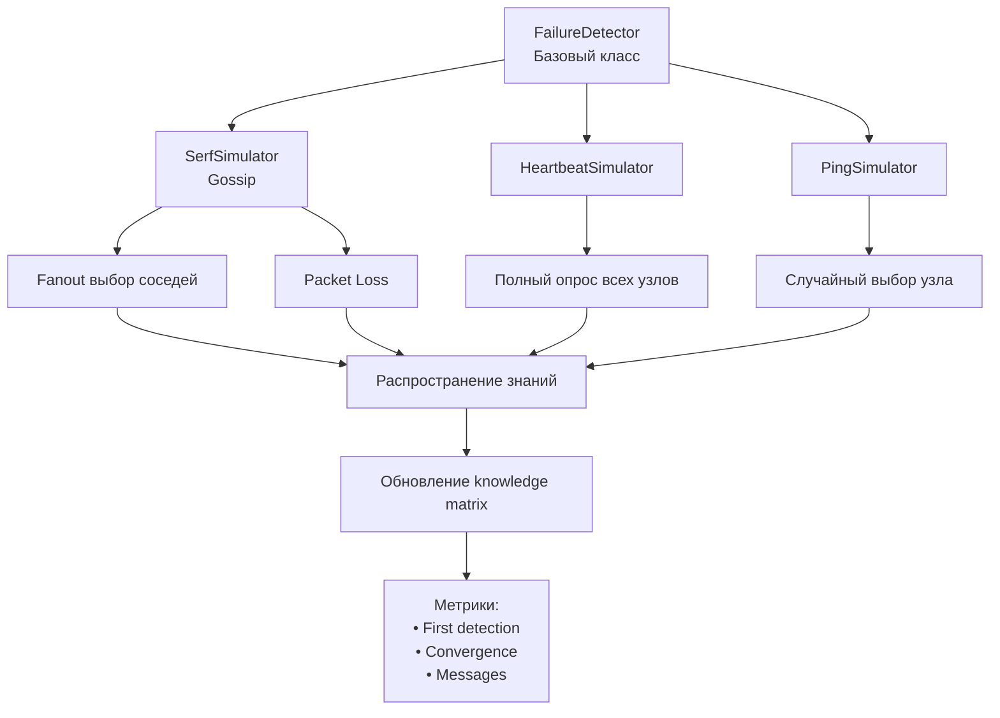

# Лабораторная работа №3-2

## Обнаружение отказов в распределённых системах (Gossip протокол)

---

## Цель работы

Изучить методы обнаружения отказов в распределённых системах на примере протокола Gossip (модель Serf), провести сравнительный анализ с подходами Heartbeat и Ping, а также исследовать влияние сетевых параметров на скорость сходимости и нагрузку на сеть.

---

## Теоретическая часть

### Обнаружение отказов

Обнаружение отказов (Failure Detection) — это механизм, позволяющий узлам распределённой системы определять, когда другие узлы перестают функционировать.

---

### Gossip-протокол

Gossip — это децентрализованный вероятностный алгоритм, работающий по принципу распространения слухов:

* узел периодически активируется
* выбирает случайных соседей (fanout)
* обменивается с ними информацией

Особенности:

* высокая масштабируемость
* устойчивость к сбоям
* вероятностная сходимость

---

### Heartbeat (Full-mesh)

Каждый узел проверяет все остальные узлы на каждом такте.

Особенности:

* очень быстрое обнаружение отказов
* высокая нагрузка на сеть: **O(N²)**

---

### Ping (Random Probe)

Каждый узел проверяет одного случайного соседа.

Особенности:

* низкий трафик
* медленное обнаружение отказов

---

## Архитектура системы

---

## Расчёт пропускной способности

Используем формулу:

Bandwidth = (1 / T) × k × N_active × PacketSize × Overhead

где:

* T — интервал gossip
* k — fanout
* N — количество активных узлов

Потери пакетов не уменьшают трафик, так как пакеты всё равно отправляются.

---

## Практическая часть

### Параметры экспериментов

| Параметр             | Значение |
| -------------------- | -------- |
| Количество узлов (N) | 50       |
| Отказавшие узлы      | 5%       |
| Gossip Interval      | 0.2 сек  |
| Fanout               | 3        |

---

## Сравнение протоколов

### Метрики:

* Время первого обнаружения
* Время полной сходимости
* Количество сообщений

---

### Результаты

#### Gossip (Serf)

* быстрая сходимость
* умеренный трафик
* хорошая масштабируемость

#### Heartbeat

* минимальное время обнаружения
* очень высокий трафик

#### Ping

* минимальный трафик
* очень медленное обнаружение

---

## Индивидуальное задание (Вариант 4)

### Устойчивость к потере пакетов

Исследуемые значения потерь:

* 0%, 5%, 10%, 20%, 30%

---

### Наблюдения

* при увеличении потерь растёт время сходимости
* время первого обнаружения увеличивается умеренно
* количество сообщений остаётся примерно постоянным

---

### Вывод

Gossip-протокол демонстрирует устойчивость к потерям пакетов:

* корректно работает даже при 30% потерь
* деградация происходит постепенно
* сохраняется работоспособность системы

---

## Анализ сложности

| Протокол  | Сложность  | Масштабируемость |
| --------- | ---------- | ---------------- |
| Gossip    | O(N log N) | Хорошая          |
| Heartbeat | O(N²)      | Плохая           |
| Ping      | O(N)       | Отличная         |

---

## Выводы

1. Gossip-протокол является оптимальным компромиссом между скоростью и нагрузкой
2. Heartbeat не подходит для больших систем
3. Ping слишком медленный для практического применения
4. Потери пакетов существенно влияют на время сходимости
5. Gossip остаётся устойчивым даже при высоких потерях

---

## Используемые технологии

* Python 3.8+
* numpy
* pandas
* matplotlib
* Google Colab

---

## Итог

В ходе работы были реализованы и исследованы три подхода к обнаружению отказов. Результаты показали, что Gossip-протокол обеспечивает наилучший баланс между скоростью обнаружения и сетевой нагрузкой, особенно в условиях нестабильной сети.
