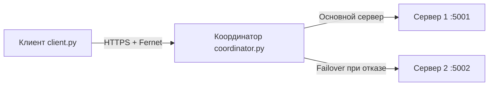

# Лабораторная работа №4

## Выполнил

* **ФИО:** Горынин Леонид Анатольевич
* **Группа:** ЦИБ-241
* **Вариант:** 4

---

# Тема работы

Разработка распределённой защищённой системы с использованием:

* HTTPS
* mTLS
* PKI
* симметричного шифрования Fernet
* механизма отказоустойчивости (Failover)
* RBAC (Role-Based Access Control)

---

# Цель работы

Реализовать защищённое взаимодействие между клиентом и сервером с использованием HTTPS и сертификатов X.509, обеспечить шифрование данных алгоритмом Fernet, а также реализовать механизм автоматического переключения на резервный сервер при отказе основного.

---

# Индивидуальное задание

## Вариант 4 — RBAC

Реализована ролевая модель доступа:

| Роль  | Разрешённые действия |
| ----- | -------------------- |
| admin | read, write, delete  |
| user  | read                 |

Клиент передаёт:

* роль пользователя
* действие

Сервер выполняет проверку прав доступа.

При отсутствии прав сервер возвращает ошибку доступа.

---

# Используемые технологии

* Python 3.8+
* Flask
* requests
* cryptography
* OpenSSL

---

# Архитектура системы



---

# Структура проекта

```text
lab_04/
│
├── certificates/
│   ├── ca_cert.pem
│   ├── ca_key.pem
│   ├── server_cert.pem
│   ├── server_key.pem
│   ├── client_cert.pem
│   └── client_key.pem
│
├── server.py
├── client.py
├── coordinator.py
├── generate_key.py
├── generate_certificates.sh
├── encryption_key.txt
├── requirements.txt
└── README.md
```

---

# Настройка окружения

## 1. Создание виртуального окружения

```bash
python3 -m venv venv
source venv/bin/activate
```

---

## 2. Установка зависимостей

```bash
pip install -r requirements.txt
```

---

# requirements.txt

```text
flask
cryptography
requests
```

---

# Генерация сертификатов (PKI)

## Создание сертификатов

```bash
chmod +x generate_certificates.sh
./generate_certificates.sh
```

Будут созданы:

* сертификат центра сертификации (CA)
* сертификат сервера
* сертификат клиента

---

# Генерация ключа Fernet

```bash
python3 generate_key.py
```

Будет создан файл:

```text
encryption_key.txt
```

---

# Исходные коды
Сервер 

```python
from flask import Flask, request, jsonify
from cryptography.fernet import Fernet
import ssl
import sys

app = Flask(__name__)

PORT = int(sys.argv[1])

# Загрузка ключа шифрования
with open("encryption_key.txt", "rb") as f:
    key = f.read()

cipher = Fernet(key)

# RBAC
ROLE_PERMISSIONS = {
    "admin": ["read", "write", "delete"],
    "user": ["read"]
}


@app.route("/process", methods=["POST"])
def process_data():
    try:
        data = request.json

        encrypted_message = data["message"].encode()
        role = data["role"]
        action = data["action"]

        # Проверка прав доступа
        if action not in ROLE_PERMISSIONS.get(role, []):
            return jsonify({
                "status": "error",
                "message": f"Access denied for role '{role}'"
            }), 403

        # Расшифровка сообщения
        decrypted_message = cipher.decrypt(encrypted_message).decode()

        print(f"[SERVER {PORT}] Получено сообщение: {decrypted_message}")

        # Приведение к нижнему регистру
        message_lower = decrypted_message.lower()

        # Логика ответов сервера
        if "привет" in message_lower:
            response_text = (
                f"Ответ сервера на порту {PORT}: "
                f"Привет! Как дела?"
            )

        elif "как дела" in message_lower:
            response_text = (
                f"Ответ сервера на порту {PORT}: "
                f"У меня всё отлично 😄 А у тебя?"
            )

        elif "пока" in message_lower:
            response_text = (
                f"Ответ сервера на порту {PORT}: "
                f"Пока! Хорошего дня 👋"
            )

        elif "кто ты" in message_lower:
            response_text = (
                f"Ответ сервера на порту {PORT}: "
                f"Я защищённый сервер распределённой системы"
            )

        elif "сервер" in message_lower:
            response_text = (
                f"Ответ сервера на порту {PORT}: "
                f"Сейчас запрос обработал сервер {PORT}"
            )

        else:
            response_text = (
                f"Ответ сервера на порту {PORT}: "
                f"получено сообщение '{decrypted_message}'"
            )

        # Шифрование ответа
        encrypted_response = cipher.encrypt(
            response_text.encode()
        ).decode()

        return jsonify({
            "status": "success",
            "response": encrypted_response
        })

    except Exception as e:
        return jsonify({
            "status": "error",
            "message": str(e)
        }), 500


if __name__ == "__main__":

    # HTTPS SSL context
    context = ssl.SSLContext(ssl.PROTOCOL_TLS_SERVER)

    context.load_cert_chain(
        certfile="certificates/server_cert.pem",
        keyfile="certificates/server_key.pem"
    )

    app.run(
        host="0.0.0.0",
        port=PORT,
        ssl_context=context
    )
```

Клиент

```python
import requests
from cryptography.fernet import Fernet

# Загрузка ключа
with open("encryption_key.txt", "rb") as f:
    key = f.read()

cipher = Fernet(key)

message = input("Введите сообщение: ")

role = input("Введите роль (admin/user): ")

action = input("Введите действие (read/write/delete): ")

encrypted_message = cipher.encrypt(message.encode()).decode()

payload = {
    "message": encrypted_message,
    "role": role,
    "action": action
}

response = requests.post(
    "http://localhost:8000/request",
    json=payload
)

data = response.json()

if data["status"] == "success":

    encrypted_response = data["response"].encode()

    decrypted_response = cipher.decrypt(encrypted_response).decode()

    print(decrypted_response)

else:
    print("\nОшибка:")
    print(data["message"])
```


Координатор

```python
from flask import Flask, request, jsonify
import requests
import urllib3

urllib3.disable_warnings(urllib3.exceptions.InsecureRequestWarning)

app = Flask(__name__)

SERVERS = [
    "https://127.0.0.1:5001/process",
    "https://127.0.0.1:5002/process"
]

CERT = (
    "certificates/client_cert.pem",
    "certificates/client_key.pem"
)


@app.route("/request", methods=["POST"])
def forward_request():

    data = request.json

    for server in SERVERS:

        try:
            response = requests.post(
                server,
                json=data,
                cert=CERT,
                verify=False,
                timeout=3
            )

            return jsonify(response.json())

        except Exception as e:
            print(f"Сервер недоступен: {server}")
            print(e)

    return jsonify({
        "status": "error",
        "message": "Все серверы недоступны"
    }), 500


if __name__ == "__main__":
    app.run(port=8000)
```

# Запуск системы

## Терминал 1 — Сервер 1

```bash
python3 server.py 5001
```

---

## Терминал 2 — Сервер 2

```bash
python3 server.py 5002
```

---

## Терминал 3 — Координатор

```bash
python3 coordinator.py
```

---

## Терминал 4 — Клиент

```bash
python3 client.py
```

---

# Реализованный функционал

## HTTPS

Передача данных между компонентами выполняется по HTTPS.

---

## mTLS

Используются клиентские и серверные сертификаты X.509.

---

## Fernet-шифрование

Полезная нагрузка дополнительно шифруется алгоритмом Fernet.

---

## Failover

Координатор автоматически перенаправляет запросы на резервный сервер при отказе основного.

---

## RBAC

Реализована ролевая модель доступа:

* user → только read
* admin → read/write/delete

---

# Демонстрация работы

## 1. Успешный запрос


---

## 2. Демонстрация отказоустойчивости (Failover)


Данный ответ показывает, что после остановки сервера 5001 запрос был автоматически перенаправлен на сервер 5002.

---

## 3. Демонстрация RBAC


---

# Принцип работы системы

1. Клиент вводит сообщение, роль и действие.
2. Сообщение шифруется алгоритмом Fernet.
3. Координатор принимает запрос.
4. Координатор пересылает запрос на основной сервер.
5. Сервер проверяет права доступа пользователя.
6. Сервер расшифровывает сообщение.
7. Сервер формирует ответ.
8. Ответ шифруется и отправляется клиенту.
9. При недоступности основного сервера координатор автоматически переключается на резервный сервер.

---

# Вывод

В ходе лабораторной работы была разработана распределённая защищённая система с поддержкой: PKI и сертификатов X.509, HTTPS, Fernet-шифрования, ролевой модели доступа RBAC, механизма отказоустойчивости Failover

Система успешно обеспечивает защищённую передачу данных и автоматическое переключение на резервный сервер при отказе основного.
